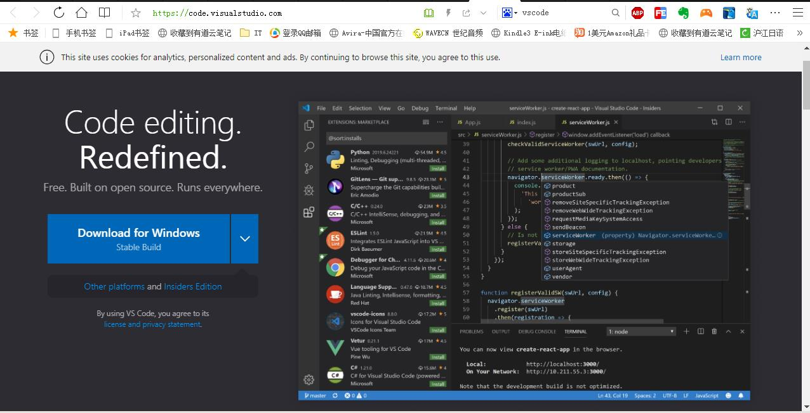
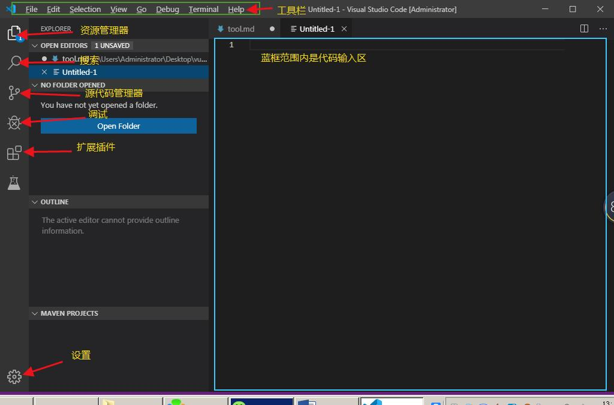
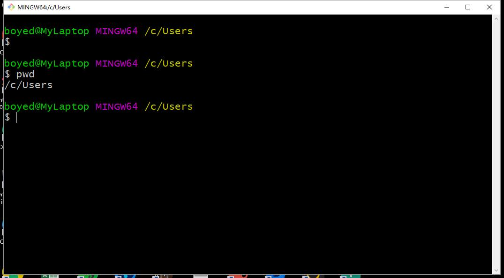

# 学好编程的基本前提
## 熟练的打字速度
## 对英语熟悉
# 基础工具软件
## Visual Studio Code
> VS Code是微软推出的新一代免费开源的现代化轻量级代码编辑器，支持几乎所有主流的开发语言的语法高亮、智能代码补全、自定义快捷键、括号匹配和颜色区分、代码片段、代码对比 Diff、GIT命令 等特性，支持插件扩展，并针对网页开发和云端应用开发做了优化。软件跨平台支持 Win、Mac 以及 Linux，运行流畅，可谓是微软的良心之作

官方网站<https://code.visualstudio.com/>

## VS Code功能简单介绍

### 常用快捷键
Ctrl + Shift + E 资源管理器  
Ctrl + Shift + F 搜索  
Ctrl + Shift + G 源代码管理器  
Ctrl + Shift + D 调试  
Ctrl + Shift + X 插件扩展  
F1 或 Ctrl+ Shift + p 打开命令面板  
Shift + Alt + F 代码格式化  
Ctrl+ F 查找  
Ctrl+ H 查找替换  
Ctrl+ N 新建文件  
Ctrl+ S 保存  
Alt + ↑ 或 Alt + ↓ 上下移动一行  
Shift + Alt + ↑ 或 Shift + Alt + ↓ 向上向下复制一行  
F11 全屏
### 修改快捷键
#### File -> Preferences -> Keyboard Shortcuts，或者：Alt+F -> p -> k

## 扩展插件
扩展插件的查找安装：

## 常用插件
* 中文语言包 Chinese (Simplified) Language Pack for Visual Studio Code
* MarkDown预览增强 Markdown Preview Enhanced
* 代码拼写检查器 Code Spell Checker
* VS Code图标 vscode-icons
* 格式化代码工具 beautify
* HTML代码提示器 HTML Snippets
* CSS样式提升器 HTML CSS Support
* 各种皮肤主题 例如：One Dark Pro，Bimbo，Atom One Dark Theme  

********

# MarkDown
> Markdown是一种轻量级可以使用普通文本编辑器编写的标记语言，通过简单的标记语法，它可以使普通文本内容具有一定的格式。同时MarkDown文档可以输出为HTML,PDF等多种各种文件。

# 基本语法
* 标题
> 标题能显示出文章的结构。行首插入1-6个 # ，每增加一个 # 表示更深入层次的内容，对应到标题的深度由 1-6 阶。

~~~       
# 一级标题
## 二级标题
### 三级标题
#### 四级标题
##### 五级标题
###### 六级标题 
~~~
* 加粗文本  
**文本加粗**
~~~
**文本加粗**
~~~
* 斜体  
*斜体文字*
~~~
*斜体文字*
~~~
* 下划线  
<u>下划线</u>
~~~
<u>下划线</u>
~~~
* 删除线  
~~斜体文字~~
~~~
~~斜体文字~~
~~~
* 分隔线  
下面是一条分隔线
***
~~~
下面是一条分隔线  
***
~~~
* 引用文本
> 这是一段介绍Markdown语法的文字。
~~~
> 这是一段介绍Markdown语法的文字。
~~~
* 符号列表或数字列表
    - 圆点符号
    1. 数字序列
    2. 数字序列
~~~
* 圆点符号
1. 数字序列
2. 数字序列
~~~
* 添加代办事项  
~~谁是最好的语言~~
* [ ] JavaScript
* [ ] PHP
* [ ] C#
* [x] Markdown
~~~
* [ ] JavaScript
* [ ] PHP
* [ ] C#
* [x] Markdown
~~~
* 插入链接  
[VSCode官网](https://code.visualstudio.com/)  
[MarkDown百度百科](https://baike.baidu.com/item/markdown/3245829?fr=aladdin)
~~~
[VSCode官网](https://code.visualstudio.com/)  
[MarkDown百度百科](https://baike.baidu.com/item/markdown/3245829?fr=aladdin)
~~~
* 插入图片
> 支持嵌入网络图片或者直接拖入本地图片，其中本地图片格式支持 jpg、png 和 gif。

~~~

~~~
* 插入表格
    | 帐户类型 | 免费帐户 | 标准帐户 | 高级帐户 |
    | --- | --- | --- | --- |
    | 帐户流量 | 60M | 1GB | 10GB |
    | 设备数目 | 2台 | 无限制 | 无限制 |
    | 当前价格 | 免费 | ￥8.17/月 | ￥12.33/月|
~~~
| 帐户类型 | 免费帐户 | 标准帐户 | 高级帐户 |
| --- | --- | --- | --- |
| 帐户流量 | 60M | 1GB | 10GB |
| 设备数目 | 2台 | 无限制 | 无限制 |
| 当前价格 | 免费 | ￥8.17/月 | ￥12.33/月|
~~~

***

* 插入代码块
> 这个功能是为了程序员量身定做的

~~~
 <!DOCTYPE html>
    <html lang="en">
    <head>
        <meta charset="UTF-8">
        <meta name="viewport" content="width=device-width, initial-scale=1.0">
        <meta http-equiv="X-UA-Compatible" content="ie=edge">
        <title>Document</title>
    </head>
    <body>
        
    </body>
        </html>
~~~

~~~
<!DOCTYPE html>
    <html lang="en">
    <head>
        <meta charset="UTF-8">
        <meta name="viewport" content="width=device-width, initial-scale=1.0">
        <meta http-equiv="X-UA-Compatible" content="ie=edge">
        <title>Document</title>
    </head>
    <body>
        
    </body>
        </html>
~~~

## MarkDown编辑工具
[VSCode](https://code.visualstudio.com/)  
[Typora](https://www.typora.io/)  
[印象笔记](https://help.yinxiang.com/)  
[Cmd Markdown 作业部落](https://www.zybuluo.com/cmd/ )  
## git & github 入门
### git简介
[git下载地址](https://git-scm.com/)
> Git是什么？Git 是 Linux 的创始人 Linus Torvalds 开源的一款分布式版本控制系统，以帮助开发者更好的对项目进行版本管理。每一个优秀的开发者在进行项目开发时都会第一时间给自己的项目加上 Git，以便能更好的追踪代码修改，进行版本回溯等操作。在多人协作的开发过程中，Git 更是必不可少的。因此，本书中将使用 Git 来管理项目的所有代码，让你在阅读本书的时候能够体会到 Git 的强大，了解实际开发中我们对 Git 的应用。
在现代化的项目开发中，Git 基本上是标配。

git有两种操作界面，命令行模式和图形界面模式，我们主要使用命令行模式。如下图所示

### git bash 命令行模式的基本特点：
> * 简洁，迅速，高效
### git bash 基础命令
> * -pwd (print working directory) 查看当前所在路径--绝对路径
>* -cd (change directory) 切换目标
>* -ls (list) 查看当前目录下的内容
>* -mkdir (make directory) 创建目录
>* -clear 清屏
> * -q 退出
### git基本原理：
> git版本管理工具，有3个工作区：  
> 1. 工作目录  
> 2. 暂存区-----存放工作中更改的文件，避免项目代码丢失。  
> 3. 代码仓库-----当开发功能足够成为一个版本时，提交到仓库。其实就是将暂存区中代码复制一份存储到代码仓库中。
### git常用命令
> * 配置git用户名和邮件
>   - git config --global user.name sun
>   - git config --global user.email sun@qq.com
> * 将工作目录中的文件添加到暂存区
>   - git add sun.html（这个命令上传一个文件） git add .(这个命令会将当前目标下所有文件上传) git add a.txt b.txt (如果上传多个，文件名之间用空格)
> * 将暂存区中的代码提交到本地仓库，形成一个版本
>       - git commit -m "备 注"（如果备注内容带空格，则需要加“”）
> * 查看本地仓库中的历史提交版本
>   - git log
### git工作流程

## [git官方教程](https://git-scm.com/book/zh/v2/%E8%B5%B7%E6%AD%A5-%E5%85%B3%E4%BA%8E%E7%89%88%E6%9C%AC%E6%8E%A7%E5%88%B6)
## github
>github是什么？github是一个基于git的代码托管平台，Github 由Chris Wanstrath, PJ Hyett 与Tom Preston-Werner三位开发者在2008年4月创办。这个星球上最流行的开源托管服务。目前已托管上百万的git项目，很多知名开源项目迁入GitHub，比如Ruby on Rails、jQuery、Ruby、Erlang/OTP；近年流行的开源库往往在GitHub首发，例如：BootStrap、Node.js、CoffeScript等。

### github的注册
[GitHub网址](https://github.com/)

github的基本使用：
1. 设置用户名和邮件
> git config  --global user.name 你自己的注册名  
> git config  --global user.email  你自己的注册邮件
2. 从GitHub远程仓库克隆自己的项目
> git clone     https://github.com/**你自己的仓库地址**
3. 进入克隆的来的文件目录，做出修改添加，然后先添加到缓存区，在提交
> git add .  
> git commit -m "代码提交信息" 
4. 将提交的结果推送到远程仓库
>  git push origin master
